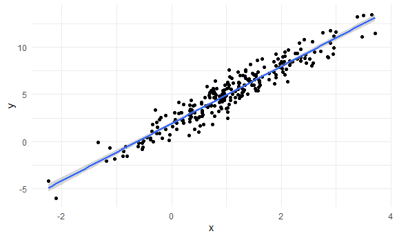
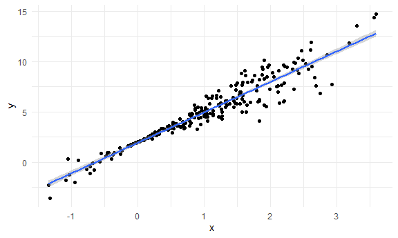
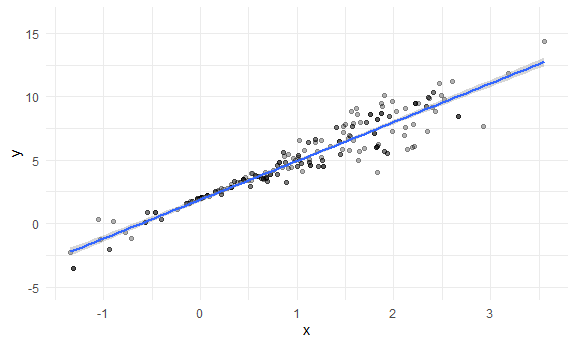

Bootstrapping
================

## Simulate data

``` r
n_samp = 250

sim_df_const =
  tibble(
    x = rnorm(n_samp, 1, 1),
    error = rnorm(n_samp, 0, 1),
    y = 2 + 3 * x + error
  )

sim_df_nonconst = 
  sim_df_const %>%
  mutate(
    error = error * .75 * x,
    y = 2 + 3 * x + error
  )
```

Plot the datasets

``` r
sim_df_const %>%
  ggplot(aes(x = x, y = y)) +
  geom_point() +
  geom_smooth(method = "lm")
```

    ## `geom_smooth()` using formula 'y ~ x'



``` r
sim_df_nonconst %>%
  ggplot(aes(x = x, y = y)) +
  geom_point() +
  geom_smooth(method = "lm")
```

    ## `geom_smooth()` using formula 'y ~ x'



``` r
lm(y ~ x, data = sim_df_const) %>% broom::tidy()
```

    ## # A tibble: 2 × 5
    ##   term        estimate std.error statistic   p.value
    ##   <chr>          <dbl>     <dbl>     <dbl>     <dbl>
    ## 1 (Intercept)     1.90    0.0898      21.2 1.44e- 57
    ## 2 x               3.03    0.0614      49.4 2.25e-130

``` r
lm(y ~ x, data = sim_df_nonconst) %>% broom::tidy()
```

    ## # A tibble: 2 × 5
    ##   term        estimate std.error statistic   p.value
    ##   <chr>          <dbl>     <dbl>     <dbl>     <dbl>
    ## 1 (Intercept)     2.08    0.0999      20.9 1.67e- 56
    ## 2 x               2.90    0.0682      42.5 9.02e-116

## Draw one bootstap sample

``` r
boot_sample = function(df) {
  
  sample_frac(df, replace = TRUE) %>%
    arrange(x)
  
}
```

Check if this works ..

``` r
boot_sample(sim_df_nonconst) %>%
  ggplot(aes(x = x, y = y)) +
  geom_point(alpha = .3) +
  geom_smooth(method = "lm") +
  ylim(-5, 16)
```

    ## `geom_smooth()` using formula 'y ~ x'



``` r
boot_sample(sim_df_nonconst) %>%
  lm(y ~ x, data = .) %>%
  broom::tidy()
```

    ## # A tibble: 2 × 5
    ##   term        estimate std.error statistic   p.value
    ##   <chr>          <dbl>     <dbl>     <dbl>     <dbl>
    ## 1 (Intercept)     2.16    0.0935      23.1 9.27e- 64
    ## 2 x               2.82    0.0676      41.7 5.40e-114
