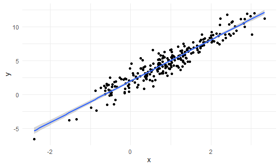
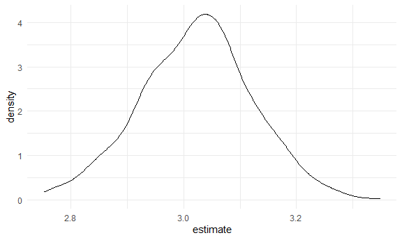

Bootstrapping
================

## Simulate data

``` r
n_samp = 250

sim_df_const =
  tibble(
    x = rnorm(n_samp, 1, 1),
    error = rnorm(n_samp, 0, 1),
    y = 2 + 3 * x + error
  )

sim_df_nonconst = 
  sim_df_const %>%
  mutate(
    error = error * .75 * x,
    y = 2 + 3 * x + error
  )
```

Plot the datasets

``` r
sim_df_const %>%
  ggplot(aes(x = x, y = y)) +
  geom_point() +
  geom_smooth(method = "lm")
```

    ## `geom_smooth()` using formula 'y ~ x'



``` r
sim_df_nonconst %>%
  ggplot(aes(x = x, y = y)) +
  geom_point() +
  geom_smooth(method = "lm")
```

    ## `geom_smooth()` using formula 'y ~ x'


``` r
lm(y ~ x, data = sim_df_const) %>% broom::tidy()
```

    ## # A tibble: 2 × 5
    ##   term        estimate std.error statistic   p.value
    ##   <chr>          <dbl>     <dbl>     <dbl>     <dbl>
    ## 1 (Intercept)     1.99    0.0828      24.0 9.37e- 67
    ## 2 x               2.97    0.0598      49.7 6.22e-131

``` r
lm(y ~ x, data = sim_df_nonconst) %>% broom::tidy()
```

    ## # A tibble: 2 × 5
    ##   term        estimate std.error statistic   p.value
    ##   <chr>          <dbl>     <dbl>     <dbl>     <dbl>
    ## 1 (Intercept)     1.92    0.0857      22.5 1.06e- 61
    ## 2 x               3.03    0.0619      48.9 2.75e-129

## Draw one bootstap sample

``` r
boot_sample = function(df) {
  
  sample_frac(df, replace = TRUE) %>%
    arrange(x)
  
}
```

Check if this works ..

``` r
boot_sample(sim_df_nonconst) %>%
  ggplot(aes(x = x, y = y)) +
  geom_point(alpha = .3) +
  geom_smooth(method = "lm") +
  ylim(-5, 16)
```

    ## `geom_smooth()` using formula 'y ~ x'


``` r
boot_sample(sim_df_nonconst) %>%
  lm(y ~ x, data = .) %>%
  broom::tidy()
```

    ## # A tibble: 2 × 5
    ##   term        estimate std.error statistic   p.value
    ##   <chr>          <dbl>     <dbl>     <dbl>     <dbl>
    ## 1 (Intercept)     1.94    0.0767      25.3 1.22e- 70
    ## 2 x               2.96    0.0571      51.8 4.28e-135

## Many samples and analysis

``` r
boot_straps = 
  tibble(
    strap_number = 1:1000,
    strap_sample = rerun(1000, boot_sample(sim_df_nonconst))
  )
```

Can I run my analysis on these …?

``` r
boot_results = 
  boot_straps %>%
  mutate(
    models = map(.x = strap_sample, ~lm(y ~ x, data = .x)),
    results = map(models, broom::tidy)
  ) %>%
  select(strap_number, results) %>%
  unnest(results)
```

What do I have now?

``` r
boot_results %>%
  group_by(term) %>%
  summarize(
    mean_est = mean(estimate),
    sd_est = sd(estimate)
  )
```

    ## # A tibble: 2 × 3
    ##   term        mean_est sd_est
    ##   <chr>          <dbl>  <dbl>
    ## 1 (Intercept)     1.93 0.0581
    ## 2 x               3.02 0.0784

Look at the distributions

``` r
boot_results %>%
  filter(term == "x") %>%
  ggplot(aes(x = estimate)) +
  geom_density()
```



Construct bootstrap CI

``` r
boot_results %>%
  group_by(term) %>%
  summarize(
    ci_lower = quantile(estimate, 0.025),
    ci_upper = quantile(estimate, 0.975)
  )
```

    ## # A tibble: 2 × 3
    ##   term        ci_lower ci_upper
    ##   <chr>          <dbl>    <dbl>
    ## 1 (Intercept)     1.82     2.05
    ## 2 x               2.87     3.17

## Bootstrap using modelr

Can we simplify anything …?

``` r
sim_df_nonconst %>%
  bootstrap(1000, id = "stap_number") %>%
  mutate(
    models = map(.x = strap, ~lm(y ~ x, data = .x)),
    results = map(models, broom::tidy)
  ) %>%
  select(stap_number, results) %>%
  unnest(results) %>%
  group_by(term) %>%
  summarize(
    mean_est = mean(estimate),
    sd_est = sd(estimate)
  )
```

    ## # A tibble: 2 × 3
    ##   term        mean_est sd_est
    ##   <chr>          <dbl>  <dbl>
    ## 1 (Intercept)     1.92 0.0587
    ## 2 x               3.03 0.0778
