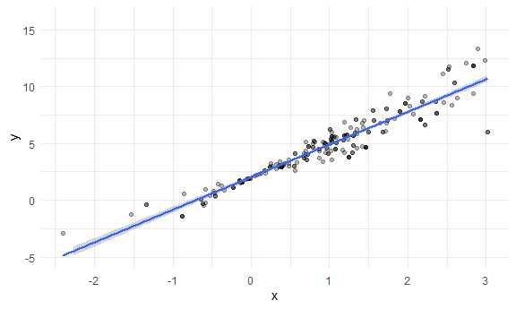

Bootstrapping
================

## Simulate data

``` r
n_samp = 250

sim_df_const =
  tibble(
    x = rnorm(n_samp, 1, 1),
    error = rnorm(n_samp, 0, 1),
    y = 2 + 3 * x + error
  )

sim_df_nonconst = 
  sim_df_const %>%
  mutate(
    error = error * .75 * x,
    y = 2 + 3 * x + error
  )
```

Plot the datasets

``` r
sim_df_const %>%
  ggplot(aes(x = x, y = y)) +
  geom_point() +
  geom_smooth(method = "lm")
```

    ## `geom_smooth()` using formula 'y ~ x'


``` r
sim_df_nonconst %>%
  ggplot(aes(x = x, y = y)) +
  geom_point() +
  geom_smooth(method = "lm")
```

    ## `geom_smooth()` using formula 'y ~ x'


``` r
lm(y ~ x, data = sim_df_const) %>% broom::tidy()
```

    ## # A tibble: 2 × 5
    ##   term        estimate std.error statistic   p.value
    ##   <chr>          <dbl>     <dbl>     <dbl>     <dbl>
    ## 1 (Intercept)     2.00    0.0855      23.3 1.53e- 64
    ## 2 x               3.03    0.0653      46.4 2.59e-124

``` r
lm(y ~ x, data = sim_df_nonconst) %>% broom::tidy()
```

    ## # A tibble: 2 × 5
    ##   term        estimate std.error statistic   p.value
    ##   <chr>          <dbl>     <dbl>     <dbl>     <dbl>
    ## 1 (Intercept)     2.02    0.0814      24.9 2.91e- 69
    ## 2 x               3.02    0.0622      48.6 1.13e-128

## Draw one bootstap sample

``` r
boot_sample = function(df) {
  
  sample_frac(df, replace = TRUE) %>%
    arrange(x)
  
}
```

Check if this works ..

``` r
boot_sample(sim_df_nonconst) %>%
  ggplot(aes(x = x, y = y)) +
  geom_point(alpha = .3) +
  geom_smooth(method = "lm") +
  ylim(-5, 16)
```

    ## `geom_smooth()` using formula 'y ~ x'



``` r
boot_sample(sim_df_nonconst) %>%
  lm(y ~ x, data = .) %>%
  broom::tidy()
```

    ## # A tibble: 2 × 5
    ##   term        estimate std.error statistic   p.value
    ##   <chr>          <dbl>     <dbl>     <dbl>     <dbl>
    ## 1 (Intercept)     1.93    0.0738      26.1 4.45e- 73
    ## 2 x               3.14    0.0596      52.7 9.37e-137

## Many samples and analysis

``` r
boot_straps = 
  tibble(
    strap_number = 1:1000,
    strap_sample = rerun(1000, boot_sample(sim_df_nonconst))
  )
```

Can I run my analysis on these …?

``` r
boot_results = 
  boot_straps %>%
  mutate(
    models = map(.x = strap_sample, ~lm(y ~ x, data = .x)),
    results = map(models, broom::tidy)
  ) %>%
  select(strap_number, results) %>%
  unnest(results)
```

What do I have now?

``` r
boot_results %>%
  group_by(term) %>%
  summarize(
    mean_est = mean(estimate),
    sd_est = sd(estimate)
  )
```

    ## # A tibble: 2 × 3
    ##   term        mean_est sd_est
    ##   <chr>          <dbl>  <dbl>
    ## 1 (Intercept)     2.02 0.0720
    ## 2 x               3.02 0.100

Look at the distributions

``` r
boot_results %>%
  filter(term == "x") %>%
  ggplot(aes(x = estimate)) +
  geom_density()
```


Construct bootstrap CI

``` r
boot_results %>%
  group_by(term) %>%
  summarize(
    ci_lower = quantile(estimate, 0.025),
    ci_upper = quantile(estimate, 0.975)
  )
```

    ## # A tibble: 2 × 3
    ##   term        ci_lower ci_upper
    ##   <chr>          <dbl>    <dbl>
    ## 1 (Intercept)     1.88     2.15
    ## 2 x               2.82     3.22

## Bootstrap using modelr

Can we simplify anything …?

``` r
sim_df_nonconst %>%
  bootstrap(1000, id = "stap_number") %>%
  mutate(
    models = map(.x = strap, ~lm(y ~ x, data = .x)),
    results = map(models, broom::tidy)
  ) %>%
  select(stap_number, results) %>%
  unnest(results) %>%
  group_by(term) %>%
  summarize(
    mean_est = mean(estimate),
    sd_est = sd(estimate)
  )
```

    ## # A tibble: 2 × 3
    ##   term        mean_est sd_est
    ##   <chr>          <dbl>  <dbl>
    ## 1 (Intercept)     2.02 0.0686
    ## 2 x               3.02 0.0977

## Revisit nyc airbnb

``` r
data("nyc_airbnb")

nyc_airbnb = 
  nyc_airbnb %>%
  mutate(stars = review_scores_location / 2) %>%
  rename(
    borough = neighbourhood_group
  ) %>%
  filter(borough != "Staten Island") %>%
  select(price, stars, borough, neighbourhood, room_type)
```

``` r
nyc_airbnb %>%
  ggplot(aes(x = stars, y = price)) +
  geom_point()
```


``` r
nyc_airbnb %>%
  filter(borough == "Manhattan") %>%
  drop_na(stars) %>%
  ggplot(aes(x = stars, y = price)) +
  geom_point()
```


We got clearly non-constant variance in the relationship between stars
and price and a few outliers, so we would like to do to get the standard
error for the linear model here bootstrap - take a sample with
replacement, fit a regression of price against stars and save the
estimated intercept and slope each time.

``` r
airbnb_boot_results = 
  nyc_airbnb %>%
  filter(borough == "Manhattan") %>%
  drop_na(stars) %>%
  bootstrap(1000, id = "stap_number") %>%
  mutate(
    models = map(.x = strap, ~lm(price ~ stars, data = .x)),
    results = map(models, broom::tidy)
  ) %>%
  select(stap_number, results) %>%
  unnest(results)
  
airbnb_boot_results %>%
  group_by(term) %>%
  summarize(
    mean_est = mean(estimate),
    sd_est = sd(estimate)
  )
```

    ## # A tibble: 2 × 3
    ##   term        mean_est sd_est
    ##   <chr>          <dbl>  <dbl>
    ## 1 (Intercept)    -33.2  33.6 
    ## 2 stars           43.1   6.83

Compare this to `lm`

``` r
nyc_airbnb %>%
  filter(borough == "Manhattan") %>%
  drop_na(stars) %>%
  lm(price ~ stars, data = .) %>%
  broom::tidy()
```

    ## # A tibble: 2 × 5
    ##   term        estimate std.error statistic  p.value
    ##   <chr>          <dbl>     <dbl>     <dbl>    <dbl>
    ## 1 (Intercept)    -34.3     22.9      -1.50 1.35e- 1
    ## 2 stars           43.3      4.78      9.07 1.39e-19

Look at the distributions

``` r
airbnb_boot_results %>%
  filter(term == "stars") %>%
  ggplot(aes(x = estimate)) +
  geom_density()
```


Construct bootstrap CI

``` r
airbnb_boot_results %>%
  group_by(term) %>%
  summarize(
    ci_lower = quantile(estimate, 0.025),
    ci_upper = quantile(estimate, 0.975)
  )
```

    ## # A tibble: 2 × 3
    ##   term        ci_lower ci_upper
    ##   <chr>          <dbl>    <dbl>
    ## 1 (Intercept)    -90.5     35.4
    ## 2 stars           29.1     54.7
