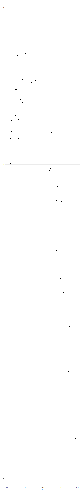
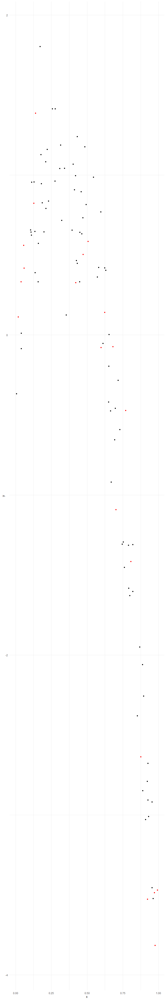
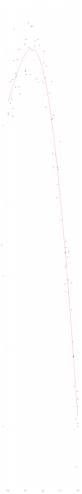
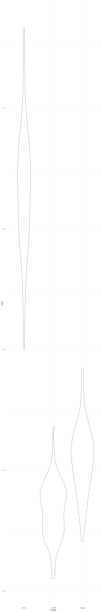
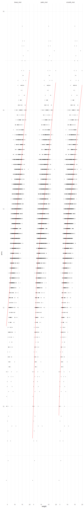
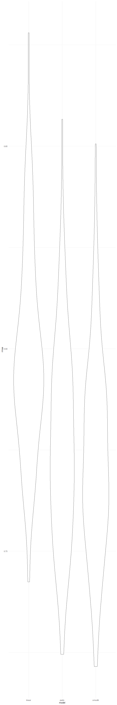

Cross Validation
================

## Step One

Cross validation “by hand” on simulated data.

``` r
nonlin_df = 
  tibble(
    id = 1:100,
    x = runif(100, 0, 1),
    y = 1 - 10 * (x - .3) ^ 2 + rnorm(100, 0, .3)
  )

nonlin_df %>% 
  ggplot(aes(x = x, y = y)) + 
  geom_point()
```



Let’s get this by hand. \[80% data for training, 20% data for testing\]

``` r
train_df = sample_n(nonlin_df, 80)
test_df = anti_join(nonlin_df, train_df, by = "id")
```

``` r
train_df %>%
  ggplot(aes(x = x, y = y)) + 
  geom_point() +
  geom_point(data = test_df, color = "red")
```



Let’s try to fit three models.

``` r
linear_mod = lm(y ~ x, data = train_df)
smooth_mod = mgcv::gam(y ~ s(x), data = train_df)
wiggly_mod = mgcv::gam(y ~ s(x, k = 30), sp = 10e-6, data = train_df)
```

Let’s see the results.

``` r
train_df %>%
  add_predictions(smooth_mod) %>%
  ggplot(aes(x = x, y = y)) +
  geom_point() + 
  geom_line(aes(y = pred), color = "red")
```



Let’s make predictions and compute RMSEs.

\[RMSEs = prediction errors (lower is better)\]

``` r
rmse(linear_mod, test_df)
```

    ## [1] 0.9594049

``` r
rmse(smooth_mod, test_df)
```

    ## [1] 0.3186715

``` r
rmse(wiggly_mod, test_df)
```

    ## [1] 0.4131435

## Can we iterate ..?

`cross_mc` by default gives 80% train and 20% test.

``` r
cross_valid_df = 
  crossv_mc(nonlin_df, 100) %>%
  mutate(
    train = map(train, as_tibble),
    test = map(test, as_tibble)
  ) %>%
  mutate(
    linear_mod = map(.x = train, ~lm(y ~ x, data = .x)),
    smooth_mod = map(.x = train, ~gam(y ~ s(x), data = .x)),
    wiggly_mod = map(.x = train, ~gam(y ~ s(x, k = 30), sp = 10e-6, data = .x))
  ) %>%
  mutate(
    rmse_linear = map2_dbl(.x = linear_mod, .y = test, ~rmse(model = .x, data = .y)),
    rmse_smooth = map2_dbl(.x = smooth_mod, .y = test, ~rmse(model = .x, data = .y)),
    rmse_wiggly = map2_dbl(.x = wiggly_mod, .y = test, ~rmse(model = .x, data = .y))
  )
```

What do these results say about the model choices?

``` r
cross_valid_df %>%
  select(starts_with("rmse")) %>%
  pivot_longer(
    everything(),
    names_to = "model",
    values_to = "rmse",
    names_prefix = "rmse_"
  ) %>%
  ggplot(aes(x = model, y = rmse)) + 
  geom_violin()
```



The smooth model is doing the best.

Compute averages …

``` r
cross_valid_df %>%
  select(starts_with("rmse")) %>%
  pivot_longer(
    everything(),
    names_to = "model",
    values_to = "rmse",
    names_prefix = "rmse_"
  ) %>%
  group_by(model) %>%
  summarize(avg_rmse = mean(rmse))
```

    ## # A tibble: 3 × 2
    ##   model  avg_rmse
    ##   <chr>     <dbl>
    ## 1 linear    0.936
    ## 2 smooth    0.316
    ## 3 wiggly    0.387

## Try on a real dataset.

import my data

``` r
child_growth_df = 
  read_csv("./data/nepalese_children.csv") %>%
  mutate(
    weight_cp = (weight > 7) * (weight - 7)
  )
```

    ## Rows: 2705 Columns: 5
    ## ── Column specification ────────────────────────────────────────────────────────
    ## Delimiter: ","
    ## dbl (5): age, sex, weight, height, armc
    ## 
    ## ℹ Use `spec()` to retrieve the full column specification for this data.
    ## ℹ Specify the column types or set `show_col_types = FALSE` to quiet this message.

weight vs. arm circumference

``` r
child_growth_df %>%
  ggplot(aes(x = weight, y = armc)) +
  geom_point(alpha = .3)
```


Fit the models I care about ..

``` r
linear_mod = lm(armc ~ weight, data = child_growth_df)
pwlin_mod = lm(armc ~ weight + weight_cp, data = child_growth_df)
smooth_mod = gam(armc ~ s(weight), data = child_growth_df)
```

``` r
child_growth_df %>%
  gather_predictions(linear_mod, pwlin_mod, smooth_mod) %>%
  ggplot(aes(x = weight, y = armc)) +
  geom_point(alpha = .3) +
  geom_line(aes(y = pred), color = "red") +
  facet_grid(. ~model)
```



Try to understand model fit using Cross Validation. Which is best to use
..?

See if I can fit the models to the splits…

``` r
cross_valid_df = 
  crossv_mc(child_growth_df, 100) %>%
  mutate(
    train = map(train, as_tibble),
    test = map(test, as_tibble)
  ) %>%
  mutate(
    linear_mod = map(.x = train, ~lm(armc ~ weight, data = .x)),
    pwlin_mod = map(.x = train, ~lm(armc ~ weight + weight_cp, data = .x)),
    smooth_mod = map(.x = train, ~gam(armc ~ s(weight), data = .x))
  ) %>%
  mutate(
    rmse_linear = map2_dbl(.x = linear_mod, .y = test, ~rmse(model = .x, data = .y)),
    rmse_pwlin = map2_dbl(.x = pwlin_mod, .y = test, ~rmse(model = .x, data = .y)),
    rmse_smooth = map2_dbl(.x = smooth_mod, .y = test, ~rmse(model = .x, data = .y))
  )
```

Violin plot of RMSEs.

``` r
cross_valid_df %>%
  select(starts_with("rmse")) %>%
  pivot_longer(
    everything(),
    names_to = "model",
    values_to = "rmse",
    names_prefix = "rmse_"
  ) %>%
  ggplot(aes(x = model, y = rmse)) + 
  geom_violin()
```



The models of pwlin and smooth are better.
